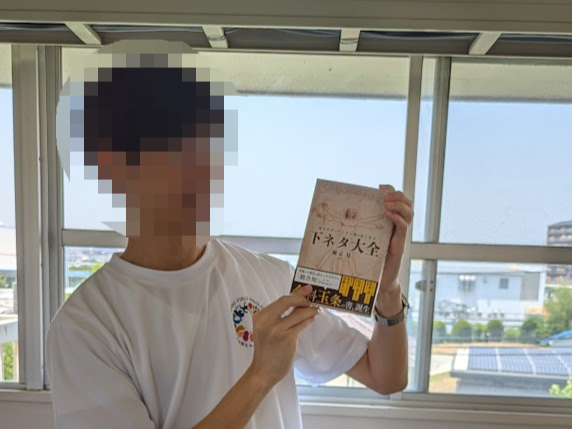

ドパガキの[@timdaik](https://x.com/timdaik)だ。

僕はここ1年半もの間[ゆる言語学ラジオ](https://www.youtube.com/@yurugengo)に沼っている。
文化や学問系のコンテンツが好きなら知っている人も多いだろう。
僕がいた高専でも見ている人はチラホラいた。
> 僕がこのチャンネルを見つけて、あまりの面白さに友人の部屋に直行して布教活動をしてみた時も「実はすでに知っていました」なんて言われちゃった。
> 悔しい悔しい悔しい悔しい

僕がこのチャンネルに出会ったのは編入勉強の真っただ中。2025年の春だった。
勉強の息抜きに見てみたが最後、春休み中の起きてから寝るまでの間、勉強時間以外はずーーっとイヤホンごしに彼らの話を聞いていた。
食事中も皿洗いの時も移動中もお風呂の中でもずーーーーっと聞いていた。

その結果、高専5年時の僕の脳内20%はおそらく堀元見さんと水野大貴さんに支配されていた。
2人の著書もガッツリ買ったし、編入試験が近づいても必ず動画は見ていた。

特に堀元さん著の下ネタ大全は最高だった！
しばらくはブックカバーに覆った本書を携えて、込み上がってくる笑いをこらえながら通学電車で3周は読んだほどだ。

成人式や卒業式よりも断然僕の関心ごとであり、高専5年生という僕を形作ったのがゆる言語学ラジオだった（なんなら卒論の謝辞にさえ書こうとしたのだからもはや熱狂レベルだ、冷静じゃない）。

そんなゆる言語学ラジオには、各学問をゆるーく学べることをテーマとした姉妹チャンネルがいくつかある。
[ゆるコンピュータ科学ラジオ](https://www.youtube.com/@yurucom)もその内のひとつだ。

実のところ、ゆる言語学ラジオよりも先にゆるコンピュータ科学ラジオを見始めたきっかけでパーソナリティ2人のファンになった。
情報系ならこのタイプもまあまあいるみたい。

扱っているテーマはチャンネル通りCS(コンピュータサイエンス)なのだが、「それって本当にCS?」って疑うほど幅広くテーマを取り扱っているのも魅力的だ。

そんな動画の中でも特に、CS専攻の僕が授業でもあまり触れないニッチなものの歴史に焦点を当てている動画が時々あるのだが、これが本当におもろい！

一見よく分からないようなモノでもストーリーを追っていくなかで歴史の分岐点を感じたり、徐々に魅力が明るみになっていくあの快感はたまらない。鬼刺さりだ。

ということで今回はゆる学徒1年生の私が選ぶ、ゆるコンのドーパミンドバドバ回を紹介する。

## 1. 棒グラフ、発明のきっかけは◯◯。#164
<iframe width="560" height="315" src="https://www.youtube.com/embed/yw55rKqpQT0?si=Oys4jPI5fRepH1h_" title="YouTube video player" frameborder="0" allow="accelerometer; autoplay; clipboard-write; encrypted-media; gyroscope; picture-in-picture; web-share" referrerpolicy="strict-origin-when-cross-origin" allowfullscreen></iframe>

[棒グラフ、発明のきっかけは◯◯。#164 - YouTube](https://www.youtube.com/watch?v=yw55rKqpQT0&t=2563s)

この回はデータ視覚化の歴史を取り扱っている。

一押しポイントとしては、当たり前のように思えるグラフを改めて見つめ直した時の異常さと、グラフ発明に至るまでのストーリーの面白さだ。

このあたりの面白さは堀元さんと水野さんが気持ちよく話してくれているので、どうか動画を見て欲しい。
一見面白くなさそうなグラフが急に魅力的に見えてくるはずだ。

## 2. 索引の発明者はサイコパス。人間性を捨てることで生まれた大発明【索引の歴史】#121
<iframe width="560" height="315" src="https://www.youtube.com/embed/7cKQh749vwI?si=nI_5t0srf-XzjQVC" title="YouTube video player" frameborder="0" allow="accelerometer; autoplay; clipboard-write; encrypted-media; gyroscope; picture-in-picture; web-share" referrerpolicy="strict-origin-when-cross-origin" allowfullscreen></iframe>

[索引の発明者はサイコパス。人間性を捨てることで生まれた大発明【索引の歴史】#121 - YouTube](https://www.youtube.com/watch?v=7cKQh749vwI&t=139s)

この回もグラフ回と同様に、私たちが当たり前に使っている索引というものが実はもの凄い思考の飛躍の元に生まれた発明なんだよ！ということを体感できるカタルシス回である。

僕が索引を初めて意識して使っていたのは小学生の数学の教科書だと記憶している。
当時小学生の僕ですら索引を使いこなして便利な仕組みだなぁとなんとなく感じていた仕組みをいざ考案しようとしたら、ここまで苦労を要するものなのか...と驚きざるを得ない。

私たちが日常的に触れているものの始まりが意外な発明によって生み出されているかもしれないと考えると、日常生活もいくらか奇妙で好奇心をそそる日常へと生まれ変わるだろう。

## 3. 暗号の歴史はエモい。言語学や数学だけでなく、◯◯さえも使っている。【暗号1】#79
<iframe width="560" height="315" src="https://www.youtube.com/embed/MdEs9oBbc3Q?si=fakHdTooyjgpp2cy" title="YouTube video player" frameborder="0" allow="accelerometer; autoplay; clipboard-write; encrypted-media; gyroscope; picture-in-picture; web-share" referrerpolicy="strict-origin-when-cross-origin" allowfullscreen></iframe>

[暗号の歴史はエモい。言語学や数学だけでなく、◯◯さえも使っている。【暗号1】#79 - YouTube](https://www.youtube.com/watch?v=MdEs9oBbc3Q)

暗号については動画がシリーズ化しており全4回に分かれている。
いわゆるピタゴラ暗号棒のようなシーザー暗号から、私たちのスマホの通信を安全に保護してくれているRSA暗号までの長～い暗号の歴史をどのようなものか体感しながら学べる構成となっている。

このシリーズを通してちょいちょい出てくる『暗号解読』もめちゃくちゃおもしろい。
勢いあまって[読書感想文](simon-singh-the-code-book-1)を書いちゃうほど良かったので、近くの図書館で借りるもよし[^1]、文庫なのでAmazonでポチるもよし、とりあえず読んでみて欲しい。

あまりCSを知らないけど読みたい人向けに少し注意点を書いておく。

僕の親戚にも勧めて貸してみたところ、何を書いているのか分からなかったそうなのだが、問題はCSの専門知識ではなく、覚えきれないほど出てくる大量の登場人物名のせいだと思う。

専門用語について知らなくても、なんとなく流し読みしてもらったほうがいいかもしれない。
なぜならストーリーに注目して読んだ方が楽しく読めるからだ。

基本はスラスラ読んでいけばいいが、途中に出てくる換字式暗号は実際に試してみると暗号の威力を肌で感じられて面白いだろう。

## まとめ
いずれも発明の歴史系を扱ったが、3つとも歴史の授業並みにドラマチックな展開が隠されているのでめちゃくちゃおもろい。

本家のゆる言語学ラジオもさることながら、ゆるコンピュータ科学ラジオを通してコンピュータサイエンスの面白さを共有できたらいいなあと思っている。

まだ昔の動画で一部見ていないものがあるので、このオススメ回紹介はまたやりたい。

[^1]: 僕は高専の図書館で借りた。工学系の学校図書館にはだいたいあるはず
