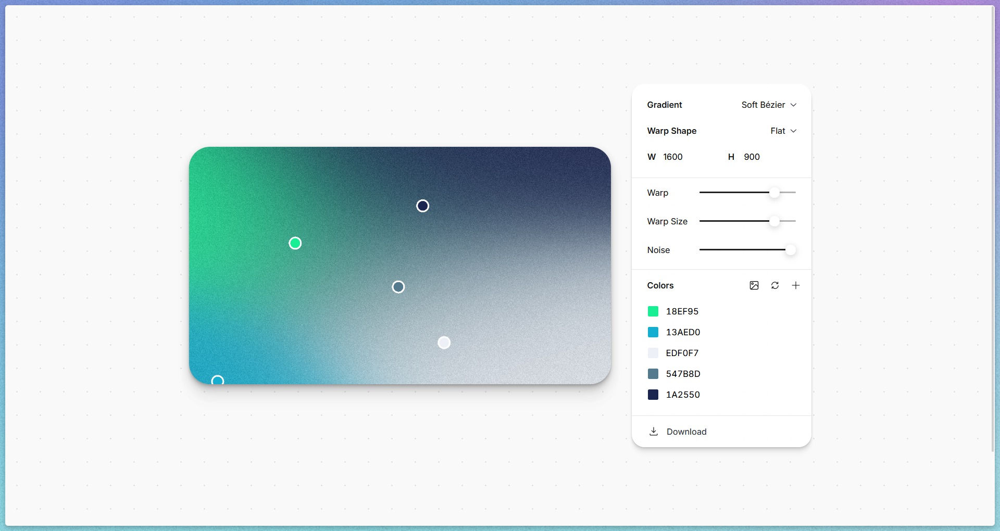
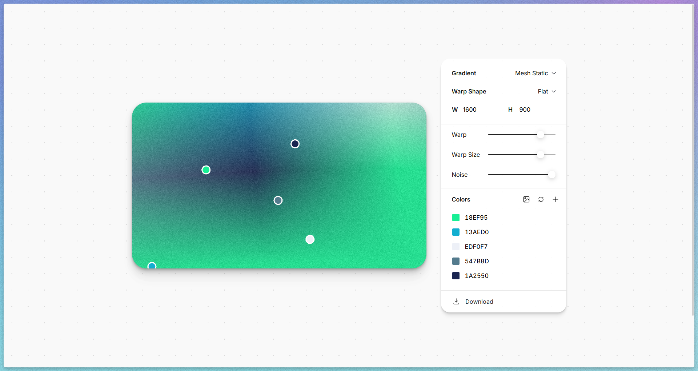
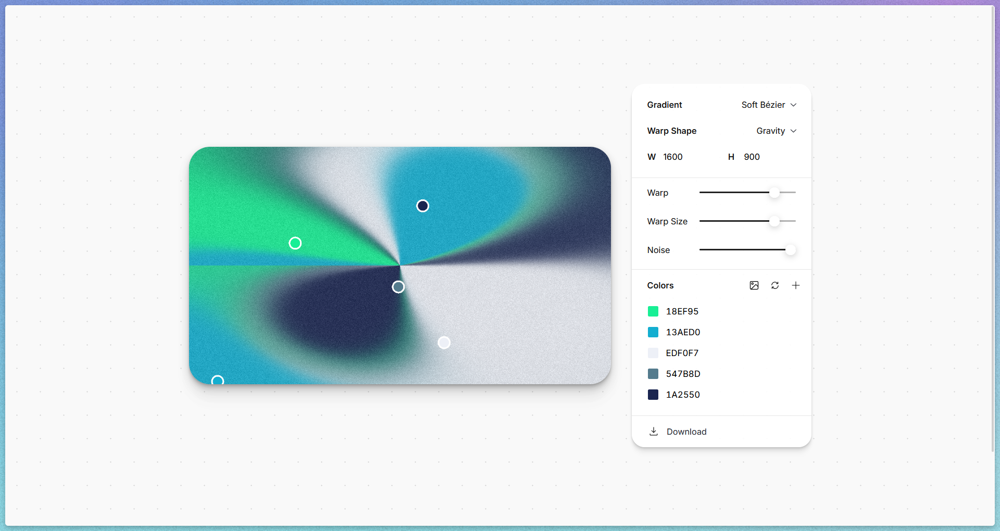
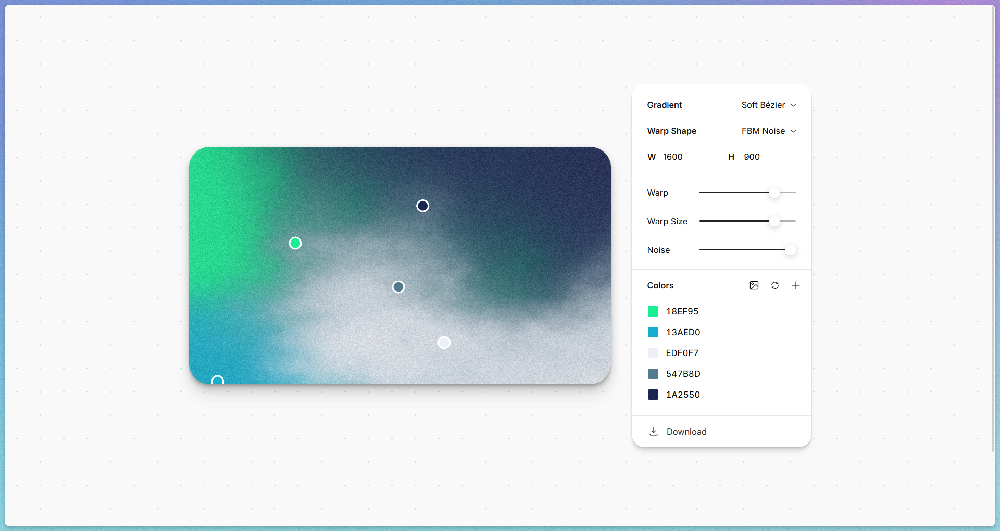

ブログのデフォルトサムネイルにいい感じの画像を作りたくなったので、「gradation generator」でググってみると、[Image to Mesh Gradient](https://photogradient.com/)というサイトを見つけて、これがなかなか面白かったので紹介したい。

こんなかんじでめっちゃいい感じのグラデーション画像を生成できる。

Gradientの箇所をMesh Staticに変更すると、

Wrap ShapeをGravityにすると、なんだか吸い込まれるような面白いデザインになる。

FBM Noiseにすると霞がかったようになってなんともエモい。
どちらかというと雲、波みたいなものか。

FBMは日本語で非整数ブラウン運動というらしく、意味不明なネーミングに惹かれてちょっと調べてみた。

TODO: ここから調べものを書いていく

### 参考
- [The Book of Shaders: Fractal Brownian Motion](https://thebookofshaders.com/13/?lan=jp)
- [フラクタルブラウン運動とドメインワープ - Qiita](https://qiita.com/edo_m18/items/e4d7a084cdbbfdc7863c)
