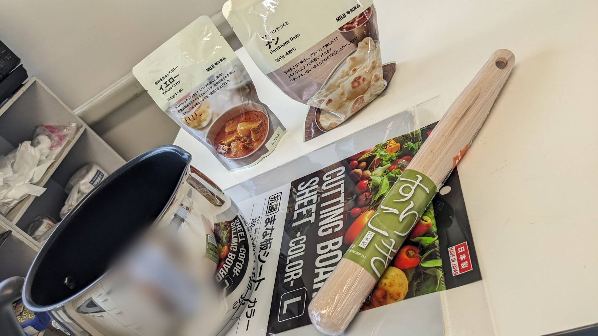
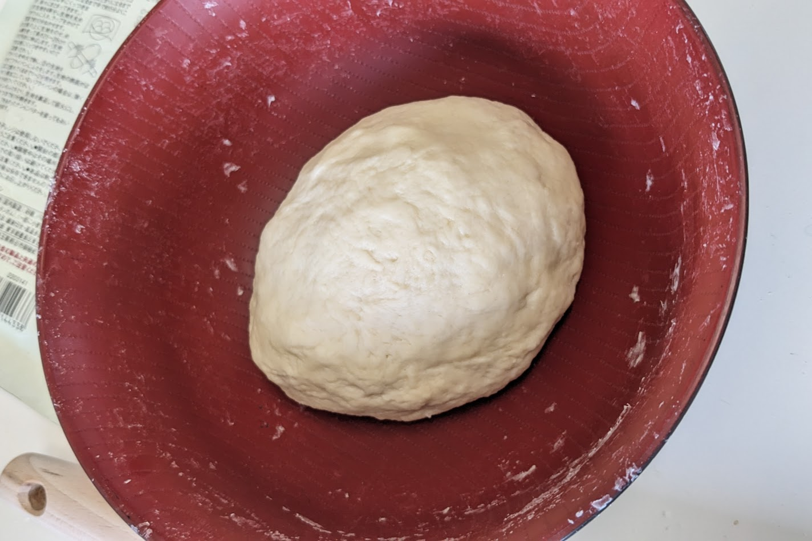
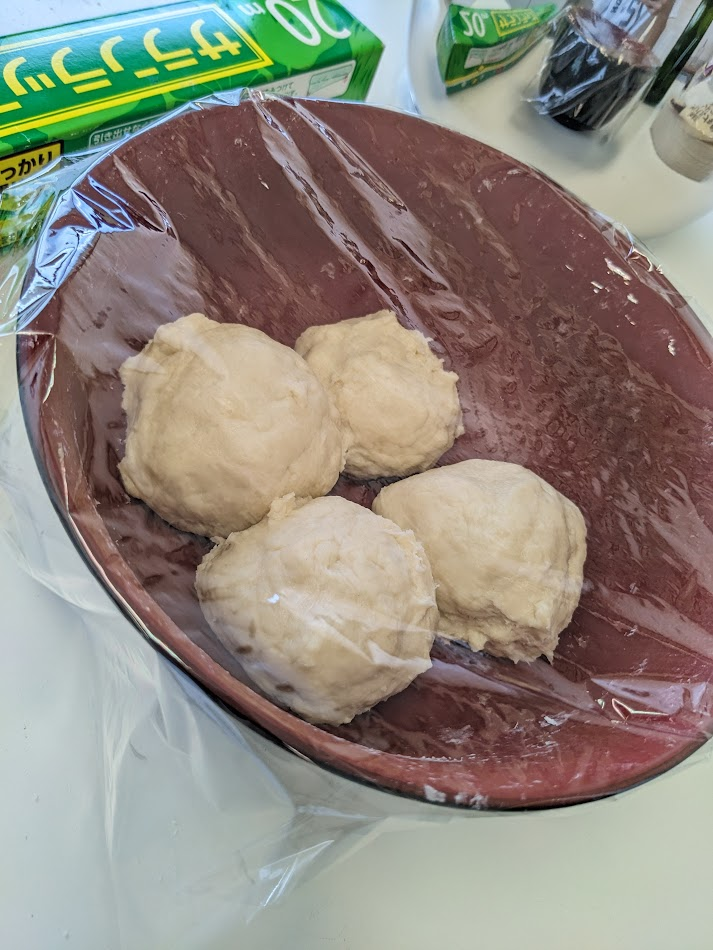
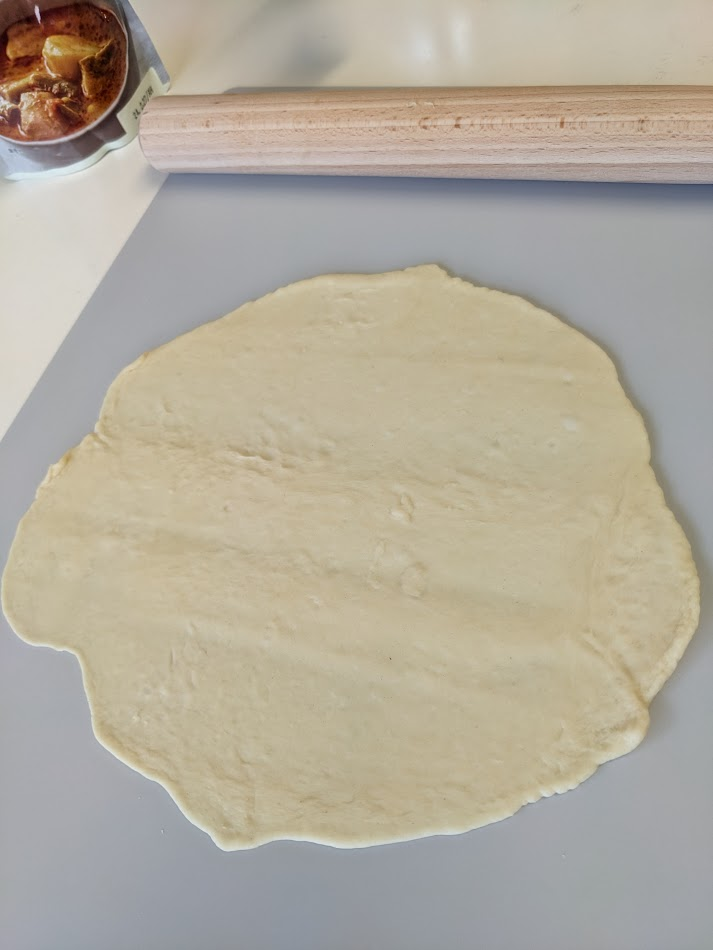
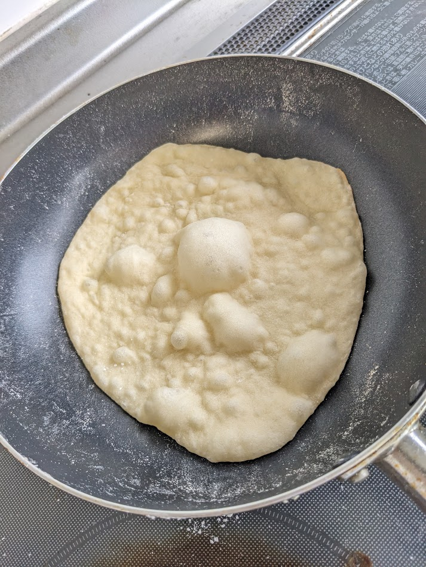
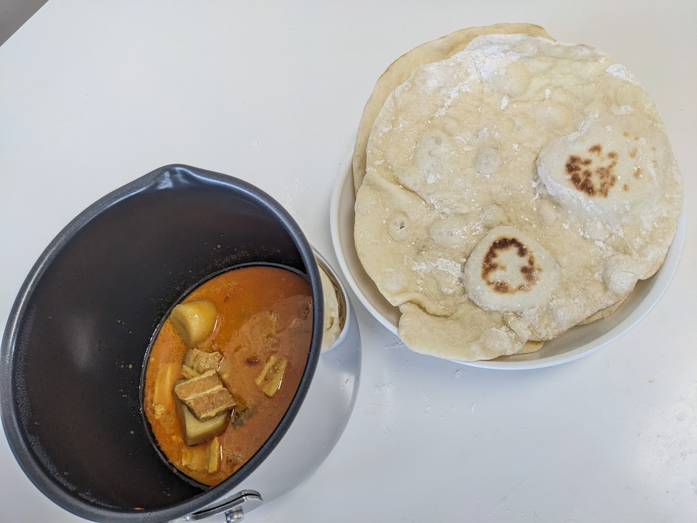
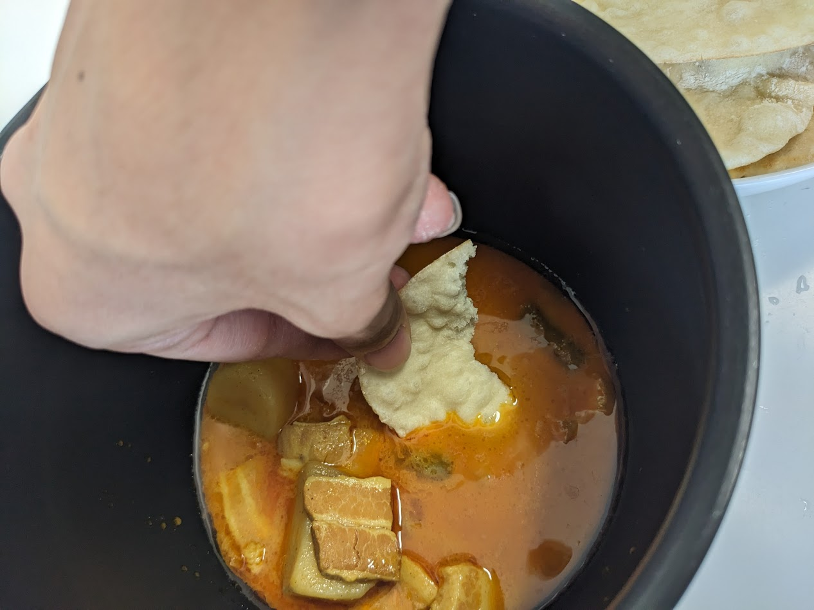
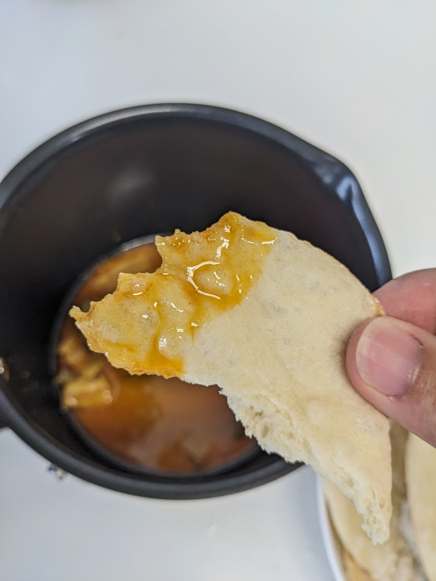

## 空前の麺棒ブーム
御昼下がりにturpanがパックカレーと怪しげな粉をもって部屋に侵入してきた。
粉の正体はナン粉であった。

「これは作るしかない」

ダイソーに麺棒と生地を広げるシートを求めて出かけた。

ムンムンとする天候の中自転車を走らせダイソーに到着。
シートは薄くて大きいまな板を購入したが、どうゆうことか麺棒が見つからない。

綿棒はあるで、とturpanがボケをかましているが、本命が見つからない。
お前はどこに指さしてるねん。

「麺を伸ばす用の麺棒をご存じですか」と留学生もびっくりの質問を店員にぶつけるが、品切れらしい。

炎天下の中、コーナンまで買い出しに行くのはしんどいわ～、と愚痴を言いながらペダルをぶん回した。

コーナンに着いたはいいが、なんだかちょっと可笑しい。
麺棒に似て非なる存在、"すりこぎ"しかないじゃないか。
すりこぎは先端から7割ほどまでは均一な太さなのだが、そこから持ち手側まで徐々にすり減っていき、均一な太さとならないのである。

これではナン生地を上手く広げられない！
が、背は腹に代えられないように、すりこぎは麺棒に代えられない、、訳ではない。
今日の所はすりこぎで勘弁してやるか、とほほ。

かくして僕の心の中には空前の麺棒ブームが沸き起こったわけである。

## ナン制作開始

材料は元より道具もそろったため、いよいよ制作に取り掛かる
ちなみに何の材料は以下の通り

- ナン粉
- 水
- 油(オリーブオイル)

そして必要な道具は以下の通り

- 麺棒(すりこぎ)
- 大きい器(どんぶり)
- シート(まな板)
- ラップ

まずどんぶりに材料を全てぶち込む。
そして手か麺棒でこれらをよーく混ぜ合わせていく。

生地がひとまとまりになったならば、4等分に切り分けてラップをふわりとかけ、10分ほど寝かせる。

この間にイエローカレーを鍋で湯煎していく。

10分経ったらいよいよ"すりこぎ"で生地を伸ばしていく。

"すりこぎ"なので不均等に生地が伸びるかなと思いきや、全然麺棒の役割を果たしてくれた。

**すりこぎ、えらい！**

思いのほか生地が麺棒(笑)に吸いついてきてムカついたので、小麦粉を散布してやった。

生地を伸ばせたら後は中火のフライパンで焼いていくだけ。

片面は蓋をしながら2分間焼いていく。
生地がいい感じに膨らんできたら、箸で器用にひっくり返し、もう片面を蓋なしで1分間焼く。
4枚の小麦粉まみれのナンが焼けたころには、イエローカレーもアツアツで良い感じ。

さて完成だ。ひたすら食そう。
無我夢中に喰らおう。

> ところで鍋がデカすぎるのに突っ込むのは勘弁してもらいたい。

イエローカレー、意外とピリ辛でスパイシーなんやな、もっとココナッツミルクが効いていて甘めのやつかと思っていた。

やけど美味いなコレ、びゃー美味い！
焼きたてのナンがもう最高。

> ナンが意外と薄っぺらくなってしまったことに突っ込むのも勘弁してもらいたい。
> 全くナンでだろうな～

ご馳走様でした。
ナンを自作する価値はあると分からせてくれたturpanには感謝。

これから思い立ったら作ってみようと思う。
以上。
